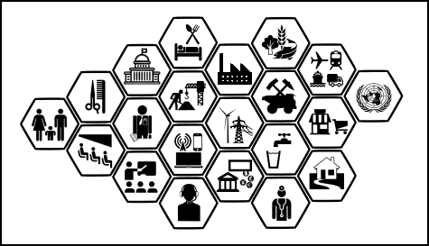
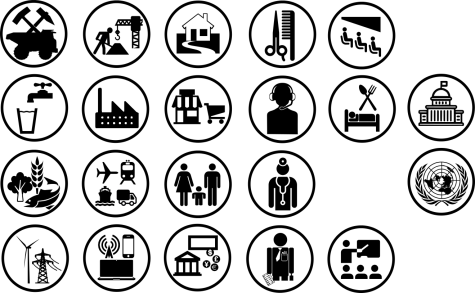
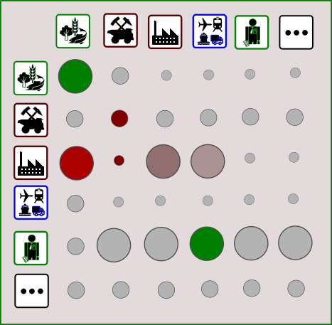

# NACE Economic Activity Visuals

A collection of SVG *pictograms* representing economic activity as classified by the NACE business sector classification. 

[NACE](http://ec.europa.eu/eurostat/statistics-explained/index.php/Glossary:Statistical_classification_of_economic_activities_in_the_European_Community_(NACE)) stands for "Nomenclature statistique des activités économiques dans la Communauté européenne", that is, the Statistical classification of economic activities in the European Community. It is a four-digit classification providing the framework for collecting and presenting a large range of statistical data according to economic activity in the fields of economic statistics (e.g. production, employment and national accounts) and in other statistical domains developed within the European statistical system (ESS). 

The pictograms represent the highest level classifications (21 in total), coded also by letters A through U in NACE Rev. 2.

# Example Usage

You can see the pictograms in live action as they are included in the Open Risk Manual:

* The [NACE Category](https://www.openriskmanual.org/wiki/Category:NACE_Classification)
* The EU Taxonomy [wiki](https://www.openriskmanual.org/wiki/EU_Taxonomy_Sector_Coverage)

## Forming hexagonal patterns

## Using the circular collection

## Using the tiles to form an Input-Output Matrix

# The Catalog of Pictograms

 A Agriculture

 B Mining

 C Manufacture

 D Electricity

 E Water

 F Construction

 G Trading

 H Transport

 I Accommodation

 J ICT

 K Finance

 L Real Estate

 M Professional

 N Administrative

 O Public sector

 P Education

 Q Health

 R Recreation

 S Other Services

 T Households

 U Supranational Entities

# The "Other" Category

Occasionally there may be a need to visualize an additional sector that is an aggregate. In this case the "Other" pictogram
can be used and is available in all three geometries.

 "Other" Category

# Files

* README.md, this file
* Catalog.ods, spreadsheet with brief description of each pictogram and attribution of sources (where applicable)
* version_1.0/pictograms/circular/*.svg, collection of pictograms with circular border
* version_1.0/pictograms/square/*.svg, collection of pictograms with square border
* version_1.0/pictograms/hexagonal/*.svg, collection of pictograms with hexagonal border

# License

[Creative Commons Commercial, Attribution, Share-alike](LICENSE.txt)
