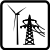
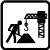

# The Catalog of Square Pictograms (NACE 2.1)

 A Agriculture

 B Mining

 C Manufacture

 D Electricity

 E Water

 F Construction

 G Trading

 H Transport

 I Accommodation

 J Publishing

 K ICT

 L Finance

 M Real Estate

 N Professional

 O Administrative

 P Public sector

 Q Education

 R Health

 S Recreation

 T Other Services

 U Households

 V Supranational Entities